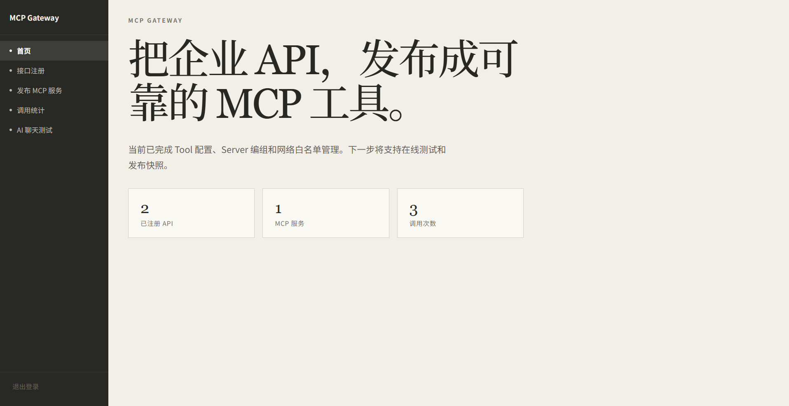
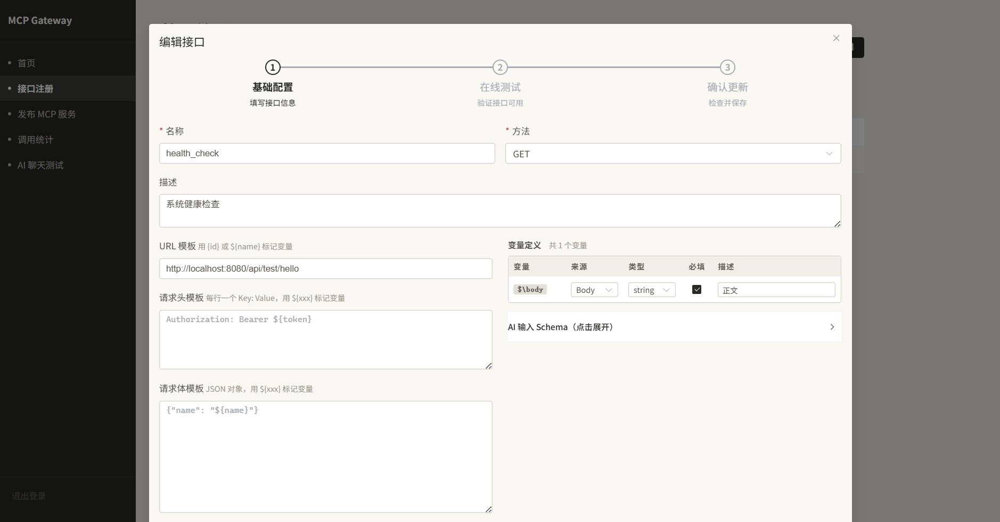
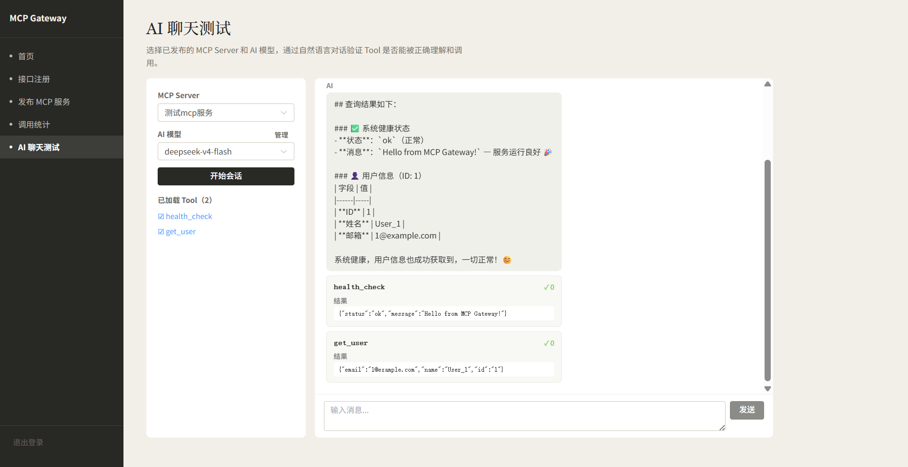

# MCP Gateway

面向企业内部 HTTP API 的 MCP Tool 发布平台。企业无需改造原有 HTTP/REST API，即可通过配置将其转换、测试并发布为标准 MCP Tool，供 AI 应用和 MCP Client 使用。

## 界面预览

| 页面 | 截图 |
|------|------|
| 仪表盘 |  |
| API 管理 |  |
| AI 聊天测试 |  |

## 技术栈

| 层 | 技术 |
|---|---|
| 后端 | JDK 17, Spring Boot 3.5.x, Spring Security |
| 数据访问 | MyBatis-Plus 3.5.x |
| 数据库迁移 | Flyway（MySQL）/ SQL 初始化脚本（SQLite） |
| API 文档 | SpringDoc OpenAPI |
| MCP & AI | Spring AI 1.1.x |
| 前端 | Vue 3, TypeScript, Element Plus |
| 架构验证 | ArchUnit |
| 数据库 | MySQL（运行环境）/ SQLite（本地开发） |

## 项目结构

```text
mcp-gateway/
├─ backend/                          # Spring Boot 后端
│  ├─ src/main/java/com/example/mcpgateway/
│  │  ├─ McpGatewayApplication.java  # 入口
│  │  ├─ common/                     # 公共组件：ApiError、TraceIdFilter、GlobalExceptionHandler、配置
│  │  ├─ identity/                   # 身份认证：登录、JWT、用户管理、RBAC
│  │  ├─ system/                     # 系统监控：健康检查、状态、E2E 测试接口
│  │  ├─ apitool/                    # HTTP Tool 管理：CRUD、参数映射、上游认证
│  │  ├─ executor/                   # HTTP 执行器
│  │  ├─ network/                    # 网络白名单
│  │  ├─ gateway/                    # MCP 网关：发布服务、调用记录、调用统计
│  │  └─ aitest/                     # AI 聊天测试：OpenAI 兼容模型对话、MCP Tool 调用
│  ├─ src/main/resources/
│  │  ├─ application.yml             # 主配置（MySQL）
│  │  ├─ application-local.yml       # 本地配置（SQLite）
│  │  └─ db/                         # 数据库迁移脚本
│  └─ src/test/
├─ frontend/                         # Vue 3 管理控制台
│  └─ src/
│     ├─ api/                        # HTTP 请求层
│     ├─ router/                     # 路由与导航守卫
│     ├─ stores/                     # Pinia 状态管理
│     ├─ views/                      # 页面视图
│     └─ styles.css                  # 全局样式
├─ compose.yml                       # MySQL 容器编排
└─ docs/
   ├─ superpowers/                   # 产品文档
   │  ├─ specs/                      # 需求设计
   │  └─ plans/                      # 实施计划
   └─ development-standards.md       # 开发规范
```

## 当前完成状态

| 里程碑 | 状态 | 关键交付物 |
|---|---|---|
| 工程基线 | ✅ 完成 | Spring Boot + Vue 骨架、双 Profile 数据库、统一异常处理 |
| 认证与 RBAC | ✅ 完成 | JWT 登录/刷新/退出、BCrypt、用户 CRUD、Security 权限控制 |
| HTTP Tool 管理 | ✅ 完成 | Tool CRUD、参数映射（PATH/QUERY/HEADER/BODY）、上游认证配置 |
| MCP 服务管理 | ✅ 完成 | 创建/编组/发布/取消发布、MCP Key 管理、连接信息查看 |
| 网络白名单 | ✅ 完成 | 全局白名单配置、Server 级白名单覆盖、MCP 调用时校验 |
| MCP 网关 | ✅ 完成 | Streamable HTTP 端点、Server 凭证鉴权、调用记录与统计 |
| AI 聊天测试 | ✅ 完成 | 多模型配置、自然语言对话历史、Tool 自动调用、调用记录汇聚至统计 |
| 闭环验收 | ⬜ 进行中 | 端到端集成测试、安全测试 |

## 核心功能

### HTTP Tool 管理
将企业内部 HTTP API 注册为 MCP Tool，支持：
- **参数映射**：PATH / QUERY / HEADER / BODY 四种来源
- **上游认证**：Basic Auth、API Key（Header）、API Key（Query）三种方式
- **在线测试**：配置后可直接调用验证

### MCP 服务管理
将 Tool 编组为 MCP Server，发布后自动生成：
- **MCP 端点**：`/mcp/{serverCode}`
- **MCP Key**：用于调用鉴权，支持重置
- **发布状态**：DRAFT → PUBLISHED 切换，支持取消发布

### MCP 网关
基于 JSON-RPC 2.0 的 MCP 协议网关端点，支持：
- `initialize` / `tools/list` / `tools/call` / `ping`
- **调用统计**：按 Server、Tool、IP 维度统计调用次数、成功率、平均耗时
- **鉴权**：基于 MCP Key 的 Bearer Token 认证

### AI 聊天测试
通过自然语言对话验证 MCP Tool 是否能被 AI 正确理解和调用：
- 支持 OpenAI 兼容 API（可配置 Base URL / Model / API Key）
- 自动加载已发布 Server 的 Tool 列表作为 AI 可用工具
- 多轮对话历史
- Tool 调用结果直接显示在对话中

## 本地快速启动

### 后端（SQLite 本地开发）

```powershell
cd backend
mvn spring-boot:run -Dspring-boot.run.profiles=local
```

### 后端（MySQL）

```powershell
docker compose up -d mysql
cd backend
mvn spring-boot:run
```

### 前端

```powershell
cd frontend
npm install
npm run dev          # 开发服务器（端口 5173）
npm run build        # 生产构建
```

### 前端生产构建后与后端一起运行

```powershell
cd frontend
npm run build
# 后端会从 frontend/dist/ 提供前端静态资源
# 访问 http://localhost:8080 即可
```

## 访问入口

| 入口 | 地址 |
|---|---|
| 后端 API | `http://localhost:8080` |
| 健康检查 | `http://localhost:8080/actuator/health` |
| 系统状态 | `http://localhost:8080/api/system/status` |
| E2E 测试接口 | `http://localhost:8080/api/test/hello` |
| API 文档 | `http://localhost:8080/swagger-ui.html` |
| 前端控制台 | `http://localhost:5173`（Vite 开发服务器）|

### 默认管理员账号

- 用户名：`admin`
- 密码：`Admin@123456`

可通过环境变量 `BOOTSTRAP_ADMIN_USERNAME` / `BOOTSTRAP_ADMIN_PASSWORD` 自定义。

## 数据库说明

| 环境 | 数据库 | 迁移方式 | 配置 Profile |
|---|---|---|---|
| 运行环境 | MySQL | Flyway（`V1__`、`V2__`...） | `default` |
| 本地开发 | SQLite | `spring.sql.init` 执行 `schema.sql` | `local` |
| 测试 | SQLite（内存） | `spring.sql.init` 执行 `schema.sql` | `test` |

## API 概览

### 认证
| 方法 | 路径 | 说明 | 权限 |
|---|---|---|---|
| POST | `/api/auth/login` | 登录获取 JWT | 公开 |
| POST | `/api/auth/refresh` | 刷新 Access Token | 公开 |
| POST | `/api/auth/logout` | 退出登录（撤销 Refresh Token） | 已认证 |
| POST | `/api/auth/change-password` | 修改密码 | 已认证 |

### 用户管理
| 方法 | 路径 | 说明 | 权限 |
|---|---|---|---|
| GET | `/api/users` | 用户列表 | SYSTEM_ADMIN |
| POST | `/api/users` | 创建用户 | SYSTEM_ADMIN |
| GET | `/api/users/{id}` | 用户详情 | SYSTEM_ADMIN |
| PUT | `/api/users/{id}` | 编辑用户 | SYSTEM_ADMIN |
| PATCH | `/api/users/{id}/status` | 启用/停用用户 | SYSTEM_ADMIN |

### HTTP Tool
| 方法 | 路径 | 说明 |
|---|---|---|
| GET | `/api/http-tools` | Tool 列表 |
| POST | `/api/http-tools` | 创建 Tool |
| GET | `/api/http-tools/{id}` | Tool 详情 |
| PUT | `/api/http-tools/{id}` | 更新 Tool |
| DELETE | `/api/http-tools/{id}` | 删除 Tool |
| POST | `/api/http-tools/{id}/test` | 在线测试 Tool |

### MCP Server
| 方法 | 路径 | 说明 |
|---|---|---|
| GET | `/api/servers` | Server 列表 |
| POST | `/api/servers` | 创建 Server |
| GET | `/api/servers/{id}` | Server 详情 |
| PUT | `/api/servers/{id}` | 更新 Server |
| DELETE | `/api/servers/{id}` | 删除 Server |
| GET | `/api/servers/{id}/tools` | Server 绑定的 Tool 列表 |
| POST | `/api/servers/{id}/tools` | 绑定 Tool 到 Server |
| DELETE | `/api/servers/{id}/tools/{toolId}` | 从 Server 解绑 Tool |
| POST | `/api/servers/{id}/publish` | 发布 Server |
| POST | `/api/servers/{id}/unpublish` | 取消发布 |
| GET | `/api/servers/{id}/connection-info` | 连接信息（含 MCP Key）|
| POST | `/api/servers/{id}/reset-key` | 重置 MCP Key |

### MCP 网关
| 方法 | 路径 | 说明 |
|---|---|---|
| POST | `/mcp/{serverCode}` | MCP 协议端点（JSON-RPC 2.0）|

### 调用统计
| 方法 | 路径 | 说明 |
|---|---|---|
| GET | `/api/stats/summary` | 总览统计 |
| GET | `/api/stats/by-server` | 按 Server 统计 |
| GET | `/api/stats/by-tool` | 按 Tool 统计 |
| GET | `/api/stats/by-ip` | 按 IP 统计 |
| GET | `/api/stats/servers/{serverCode}` | 单个 Server 详情 |

### AI 聊天测试
| 方法 | 路径 | 说明 |
|---|---|---|
| POST | `/api/ai-chat/sessions` | 创建聊天会话 |
| POST | `/api/ai-chat/sessions/{id}/chat` | 发送消息 |
| DELETE | `/api/ai-chat/sessions/{id}` | 关闭会话 |

### E2E 测试
| 方法 | 路径 | 说明 |
|---|---|---|
| GET | `/api/test/hello` | 健康检查 |
| GET | `/api/test/users/{id}` | 模拟用户查询 |
| GET | `/api/test/search` | 模拟搜索 |
| POST | `/api/test/echo` | 请求回显 |

## 架构约束 — DDD 四层架构

每个业务模块按 DDD 经典四层组织，依赖方向**外向内**：

```text
controller/                 Interface 层：@RestController，仅做参数校验 + 一行调 Service
    ↓
application/service/        Application 层：用例编排、@Transactional、调 Repository 接口
    ↓
domain/                     Domain 层：纯 model/ + repository/ 接口（零框架注解）
    ↕ (implements)
infrastructure/             Infrastructure 层：MyBatis 实体、Mapper、Repository 实现、JWT/BCrypt
```

### 4 条核心规则

1. **Domain 层零框架注解**：`domain/model/` 和 `domain/repository/` 不允许 `import org.springframework.*` 或 `com.baomidou.*`
2. **跨模块通信走 Service，不走 Mapper**：模块 A 要访问模块 B 的数据，注入 B 的 Service 而非 Mapper
3. **Controller 只做两件事**：参数校验 + 一行调 Service
4. **Repository 接口属于 Domain 层**，实现在 Infrastructure 层

`ArchitectureTest` 会自动验证规则 1。详细规范见 [docs/development-standards.md](docs/development-standards.md)。

## 贡献指南

1. 新建特性分支，命名 `{type}/{description}`，如 `feat/http-tool-crud`
2. 按 [docs/development-standards.md](docs/development-standards.md) 的 DDD 四层规范编码
3. 每个里程碑完成后运行 `mvn test` 确保架构规则和集成测试通过
4. 前端开发前先完成后端接口和测试，再实现对应页面
5. 提交前确认敏感信息（密码、Token、API Key）未进入代码库

## 安全要求（开发时注意）

- 上游认证加密存储，查询 API 不回显明文
- 日志、异常、审计记录不得包含密码、Token、API Key
- 网络白名单、SSRF 防护是核心安全防线
- 普通管理员不得越权访问系统管理员专属接口
- JWT Secret 必须通过环境变量 `JWT_SECRET` 注入，不得硬编码
