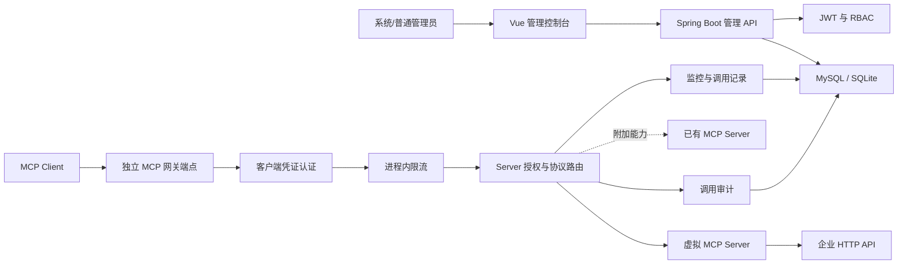

# 企业级 MCP Gateway 项目需求设计

## 1. 项目目标

建设一个面向单个企业内部 API 的 MCP 发布平台。平台的核心价值是让企业无需改造原有 HTTP/REST API，即可通过配置将其转换、测试并发布为标准 MCP Tool，供 AI 应用和 MCP Client 使用。

对企业已有 MCP Server 的接入、代理和统一管理属于附加能力，不是首要产品主线，也不得阻塞 API MCP 化核心闭环的交付。

首版采用模块化单体架构，在控制实现复杂度的同时保持清晰的领域边界，为以后接入 Redis、消息队列、可观测性平台和多实例部署预留演进空间。

## 2. 技术与部署范围

### 2.1 技术栈

- 后端：JDK 17、Spring Boot 3.5.x
- 数据访问：MyBatis-Plus 3.5.x
- 数据库迁移：Flyway（MySQL）/ SQL 脚本（SQLite）
- MCP 与 AI 集成：Spring AI 1.1.x
- API 文档：SpringDoc OpenAPI
- 架构验证：ArchUnit
- 前端：Vue 3、TypeScript、Element Plus
- 数据库：MySQL（生产）/ SQLite（本地开发）
- 缓存与限流：进程内实现（限流为第二阶段）
- 部署形态：前后端分离、单实例、支持容器化

### 2.2 当前技术选型说明

实际采用的差异决策：

- **SQLite 本地运行时**：代码库新增 `application-local.yml` profile，通过 `spring.sql.init` 而非 Flyway 管理 SQLite 建表。MySQL 与 SQLite 的双 profile 方案替代了原定的 `compose.yml` 本地方案，降低了本地启动门槛。
- **SpringDoc OpenAPI**：新增 `springdoc-openapi-starter-webmvc-ui` 生成 API 文档，原计划未明确提及。
- **Spring Security Filter 组件**：JWT 认证过滤器 (`JwtAuthenticationFilter`) 作为独立组件放在 `identity/security/` 包下（按功能归类，而非四层架构）。
- **统一响应未采用 Result 包装**：实际采用 `ResponseEntity<ApiError>` 异常处理 + 直接返回正常响应体，而非全局 APIResult 包装器。
- **角色直接存储在 users 表**：`role` 字段为 `VARCHAR` 而非独立的 `roles`/`user_roles` 表（首个实体为 `SYSTEM_ADMIN` / `OPERATOR`）。
- **无独立 `auth` 模块**：认证逻辑归属 `identity` 模块，而非独立 `auth` 包。

### 2.3 核心发布方式

- 将企业 HTTP/REST API 发布为 Streamable HTTP MCP Server

管理员先独立注册 HTTP API Tool，再自由选择多个 Tool 组成 MCP Server 并发布。一个 Tool 可以被多个 MCP Server 复用。已有 MCP Server 的代理接入在核心闭环完成后实现。首版不支持多租户和本地 stdio 进程托管。

平台统一使用 Streamable HTTP，不兼容旧版 SSE。

### 2.4 首版不包含

- 微服务拆分
- Redis 与分布式限流
- 消息队列
- 多实例和高可用
- Prometheus、Grafana、链路追踪和告警
- 完整请求或响应正文留存
- 工具级权限控制和 ABAC
- 本地 stdio MCP Server 托管
- OpenAPI 文档导入
- 多接口编排、脚本转换、JSONPath 和响应模板
- 表单及文件上传

## 3. 用户与角色

### 3.1 系统管理员

- 管理用户、角色、模型配置和网络白名单
- 管理所有 MCP Server、HTTP Tool 和客户端凭证
- 查看全局监控、调用记录和审计日志

### 3.2 普通管理员

- 管理 HTTP Tool、MCP Server 和客户端凭证
- 执行 HTTP、MCP 协议和 AI 测试
- 查看运行监控和调用记录
- 不能管理用户、模型凭证和网络白名单

### 3.3 MCP 客户端

- 使用客户端访问密钥调用授权的 MCP Server 网关端点
- 不登录管理控制台
- 不具备管理 API 权限

一个客户端凭证可关联一个或多个 MCP Server，关联关系用于限制该凭证可访问的独立网关端点。

### 3.4 当前实现状态

- 用户模型 `User`（含 `username`、`password_hash`、`role`、`status`）已完成
- `UserRole` 枚举（`SYSTEM_ADMIN`、`OPERATOR`）已完成
- `UserStatus` 枚举（`ACTIVE`、`INACTIVE`）已完成
- Bootstrap 超级管理员初始化器已完成
- 用户统一使用 `users` 表，角色为 VARCHAR 字段，未独立 `roles`/`user_roles` 表

## 4. 功能需求

### 4.1 身份认证

- 用户使用用户名和密码登录管理控制台。
- 用户密码使用 BCrypt 存储。
- 登录成功后签发短期 Access Token 和可撤销的 Refresh Token。
- 支持刷新令牌、退出登录和修改密码。
- 用户被停用后，Access Token 在后续请求校验时立即失效。

**当前实现**：

- `JwtTokenService` 签发和校验 JWT（Access Token 15 分钟，Refresh Token 7 天）
- `BcryptPasswordService` 实现 BCrypt 加密
- `JwtAuthenticationFilter` 从请求头提取并校验 JWT
- `AuthenticationService` 处理登录、刷新、退出
- `RefreshTokenRepository` 配合 `refresh_tokens` 表管理刷新令牌撤销

### 4.2 用户管理

- 系统管理员可以创建、查询、编辑、启用和停用用户。
- 用户删除采用逻辑删除，保留审计记录。

**当前实现**：

- `UserController` 提供 `/api/users/**` REST 接口（限 `SYSTEM_ADMIN` 角色访问）
- `UserManagementService` 处理用户 CRUD 和校验
- `UserRepository` / `MybatisUserRepository` 实现持久化
- `BootstrapAdminInitializer` 在启动时自动创建默认超级管理员

### 4.3 用户与 RBAC

- 平台内置 `SYSTEM_ADMIN` 和 `OPERATOR` 两个角色。
- 只有系统管理员可以管理用户和授予角色。
- 用户停用后不得登录，已有令牌也不得继续访问。

首版采用固定角色，不提供自定义角色和权限编排页面。

**当前实现**：

- Security 配置通过 `.requestMatchers("/api/users/**").hasRole("SYSTEM_ADMIN")` 强制权限
- 后续模块需要在 SecurityConfiguration 中补充各自的权限规则

### 4.4 已有 MCP Server 管理（附加能力）

该模块用于接入企业内已经实现 MCP 协议的 Server，优先级低于企业 HTTP API MCP 化。核心功能完成前，本模块只保留领域接口和导航入口规划，不要求落地。

管理字段至少包括：

- 名称和唯一 `server_code`
- 协议类型：Streamable HTTP
- 上游 URL
- 可选的上游认证配置
- 连接超时、读取超时
- 客户端限流阈值、Server 总限流阈值
- 启停状态

系统提供连接测试和健康检查。`server_code` 全局唯一，创建后不可修改，以保持网关地址稳定。

### 4.5 客户端凭证

- 系统管理员和普通管理员可创建、查询、吊销和轮换客户端凭证。
- 密钥明文只在创建或轮换成功时展示一次。
- 数据库只保存带随机盐的密钥摘要和用于定位凭证的非敏感 Key ID。
- 凭证可设置有效期、启停状态和可访问的 MCP Server。
- 轮换采用短暂重叠策略：新密钥生效后，旧密钥可配置一个不超过 24 小时的过渡期。

### 4.6 MCP 网关与路由

网关端点采用：

```text
/mcp/{serverCode}
```

调用流程：

1. 从请求头读取客户端访问密钥。
2. 根据 Key ID 定位凭证并校验密钥摘要。
3. 校验凭证和目标 MCP Server 的状态及有效期。
4. 验证凭证是否被授权访问目标 Server。
5. 执行客户端级和 Server 级进程内限流。
6. 使用 Streamable HTTP 适配器转发请求。
7. 转发 MCP 请求，并正确处理流式响应和连接关闭。
8. 记录调用结果、耗时及错误摘要。
9. 将上游响应返回客户端，不持久化完整正文。

管理 API 使用用户 JWT；MCP 网关端点使用客户端访问密钥。两种认证链路相互隔离。

### 4.7 限流

- 按客户端凭证限制单位时间请求数。
- 按 MCP Server 限制单位时间总请求数。
- 使用线程安全的进程内令牌桶或滑动窗口实现。
- 超出限制时返回明确的限流错误，并记录调用结果。

进程重启后限流状态会丢失，多实例间也不共享状态。这是首版已知限制。

**说明**：限流属于第二阶段核心治理，MVP 版本暂不实现。

### 4.8 运行监控

管理控制台展示：

- MCP Server 当前健康状态
- 请求总量
- 成功率
- 平均延迟和 P95 延迟
- 最近调用错误
- 按 Server 和时间范围筛选

调用明细持久化到 MySQL；统计指标按分钟聚合。首版健康检查由应用内定时任务执行。

### 4.9 审计日志

审计范围包括：

- 登录成功与失败
- 退出登录和密码修改
- 用户、HTTP Tool、MCP Server 和客户端凭证的配置变更
- 客户端凭证创建、轮换和吊销
- MCP 调用元数据

审计字段至少包括操作者或客户端 Key ID、事件类型、目标对象、结果、时间、来源 IP 和错误摘要。不得记录密码、令牌、客户端密钥、上游认证信息和完整 MCP 报文。

### 4.10 管理控制台

页面包括：

- 登录页
- 仪表盘
- 用户管理
- API 工具
- 虚拟 MCP Server 与发布管理
- 客户端凭证管理
- 调用记录
- 运行监控
- 审计日志
- 已有 MCP Server（附加功能）

前端根据角色隐藏无权访问的菜单和操作，但最终权限必须由后端校验。

登录后的默认首页和主要导航应围绕"API 工具 → 在线测试 → MCP 发布"设计，不以已有 MCP Server 管理作为产品入口。

**当前实现**：

- 前端已初始化 Vue 3 + TypeScript + Element Plus 项目
- 路由已配置（`src/router/index.ts`）
- 登录页已完成（`src/views/LoginView.vue`）
- 首页已完成（`src/views/HomeView.vue`，含 API 状态显示）
- `src/views/LoginView.test.ts` 测试文件已存在
- 样式文件 `src/styles.css` 已存在
- API 层骨架已创建（`src/api/`）
- Pinia store 骨架已创建（`src/stores/`）

### 4.11 企业 HTTP API MCP 化

管理员可以将已有的单个 HTTP/REST 接口手工注册为独立 Tool。一个 HTTP 接口对应一个 Tool；多个 Tool 可自由组成一个 MCP Server，一个 Tool 也可以加入多个 MCP Server。

虚拟 MCP Server 包含：

- 名称、描述和全局唯一编码
- 草稿版本、当前已发布版本和启停状态
- Streamable HTTP 发布能力
- 独立网关地址：`/mcp/{serverCode}`

HTTP Tool 包含：

- Tool 名称和描述，名称在同一虚拟 Server 版本内唯一
- HTTP 方法、目标 URL、连接超时和读取超时
- 输入 JSON Schema
- Path、Query、Header 和 JSON Body 参数映射
- 成功 HTTP 状态码范围
- 上游认证配置
- 启停状态

上游认证支持：

- 无认证
- 固定 Header
- API Key
- Bearer Token

敏感认证值必须加密保存，查询接口不得返回明文。Tool 输入参数不得覆盖由系统注入的认证 Header。

输入 Schema 同时支持可视化字段配置和 JSON Schema 高级编辑。两种模式使用同一规范化 Schema 模型，切换或保存时执行双向转换和合法性校验。

HTTP 响应按其内容类型转换为 MCP 文本或 JSON 结果，不提供 JSONPath、响应模板或脚本转换。

### 4.12 虚拟 MCP Server 发布

虚拟 MCP Server 采用"草稿 → 在线测试 → 发布"的生命周期：

1. 草稿配置可反复编辑。
2. 在线测试使用草稿配置真实调用企业接口。
3. 测试页面展示脱敏后的请求摘要、响应、耗时和错误。
4. 发布前校验 Schema、参数映射、Tool 名称、URL 和网络白名单。
5. 发布生成不可变版本快照，并原子切换当前版本。
6. 修改已发布配置时创建新草稿，不影响当前线上版本。
7. 发布失败时继续使用原版本。

首个核心版本只需支持保留当前发布快照和发布新版本；历史版本查询及一键回滚在后续阶段实现，但版本存储模型和发布接口必须支持扩展。

### 4.13 虚拟 Tool 执行

虚拟 MCP Server 的调用流程：

1. 客户端通过现有访问密钥连接虚拟 Server。
2. 网关执行凭证认证、Server 授权和限流。
3. `tools/list` 返回当前发布版本中的启用 Tool。
4. `tools/call` 按 Tool 名称加载不可变发布快照。
5. 使用 JSON Schema 校验调用参数。
6. 根据映射构建 Path、Query、Header 和 JSON Body。
7. 注入加密存储的上游认证信息。
8. 校验最终地址及 DNS 解析结果是否符合平台网络白名单。
9. 发起 HTTP 请求并限制超时、重定向次数和响应体大小。
10. 根据成功状态码配置判断执行结果。
11. 将 JSON 或文本响应转换为 MCP Tool 结果。
12. 记录调用耗时、状态及脱敏错误摘要，不持久化请求和响应正文。

### 4.14 MCP 与 AI 测试

平台提供三层测试能力：

1. HTTP 配置测试：发布前直接使用 Tool 草稿调用企业 HTTP API，验证 Schema、参数映射、认证和响应。
2. MCP 协议测试：发布后使用 Spring AI MCP Client 连接虚拟 MCP Server，依次验证初始化、`tools/list` 和 `tools/call`。
3. AI 调用测试：用户输入自然语言，由 Spring AI ChatClient 调用 OpenAI 兼容模型，并只向模型暴露当前选中的单个 Tool。

平台管理员维护一套全局模型配置：

- OpenAI 兼容 Base URL
- API Key
- Model
- 请求超时

API Key 加密存储且不回显。普通管理员可以使用已启用的全局模型执行 AI 测试，但不能读取或修改模型凭证。

AI 测试首版不允许跨 Tool、跨虚拟 Server 或多轮自动编排。测试结果展示模型回答、Tool 调用参数、脱敏后的 Tool 执行结果、耗时和错误信息。默认不持久化完整提示词、模型回答以及企业 API 响应正文。

## 5. 权限矩阵

| 能力 | 系统管理员 | 普通管理员 |
| --- | --- | --- |
| 管理用户和角色 | 是 | 否 |
| 管理全局模型配置 | 是 | 否 |
| 管理网络白名单 | 是 | 否 |
| 管理 HTTP Tool 和 MCP Server | 是 | 是 |
| 管理客户端凭证 | 是 | 是 |
| 执行三层测试 | 是 | 是 |
| 查看运行监控与调用记录 | 是 | 是 |
| 查看审计日志 | 是 | 否 |

## 6. 架构设计

### 6.1 DDD 四层架构（已落地）

每个业务模块严格按以下 4 层组织：

```
┌──────────────────────────────────────────┐
│  controller/         Interface 层         │
│  @RestController, 参数校验, DTO record    │
├──────────────────────────────────────────┤
│  application/service/  Application 层     │
│  @Service, @Transactional, 用例编排       │
├──────────────────────────────────────────┤
│  domain/               Domain 层          │
│  model/    纯 record/enum，零框架注解     │
│  repository/  Repository 接口             │
├──────────────────────────────────────────┤
│  infrastructure/      Infrastructure 层   │
│  persistence/  Mapper, Row, Repository 实现│
│  security/     JWT/BCrypt 实现            │
└──────────────────────────────────────────┘
```

依赖方向：

```
controller  →  application/service  →  domain/repository
                                          ↓ (implements)
                                    infrastructure/
```

**规则**：

- Controller **只调** Application Service，**不调** Domain 或 Infrastructure
- Application Service **调** Domain 的 Repository 接口
- Infrastructure **实现** Domain 的 Repository 接口
- **例外**：`identity/security/` 包下的 JWT Filter（Spring Security 组件，按功能归类而非四层）

### 6.2 架构验证

通过 ArchUnit 自动验证：

- `domain` 包不能引用 Spring、MyBatis、infrastructure
- `application` 包不能反向依赖 `controller`

新增模块时只需确保包名在 `..domain..` / `..application..` 规则下即可自动验证。详见 `ArchitectureTest.java`。

### 6.3 包命名规范

```
com.example.mcpgateway.{
    common,         // 公共组件（api 格式、全局异常、配置）
    identity,       // 身份认证模块（认证、JWT、用户管理）
    system,         // 系统监控模块（健康检查、状态）
    新业务模块       // 每个模块同级展开
}
```

每个模块内部固定包：

| 包 | 职责 | 允许的注解 |
|---|---|---|
| `controller/` | HTTP 接口 | `@RestController`, `@RequestMapping` |
| `application/service/` | 业务逻辑 | `@Service`, `@Transactional` |
| `domain/model/` | 纯领域模型 | **无** `org.springframework`, `com.baomidou` |
| `domain/repository/` | Repository 接口 | **无** `org.springframework`, `com.baomidou` |
| `infrastructure/persistence/` | 数据访问 | `@TableName`, `@TableId`, `@Mapper`, `@Repository` |
| `infrastructure/security/` | JWT/BCrypt 等安全实现 | `@Component` |

### 6.4 架构图



### 6.5 模块划分（与实施阶段对应）

系统采用模块化单体。API MCP 化相关模块构成核心领域，后端模块包括：

- `identity`：登录、JWT、刷新令牌、用户管理、固定 RBAC（**已完成 P0**）
- `system`：健康检查和系统状态（**已完成 P0**）
- `server`：附加的已有 MCP Server 配置、代理与健康检查（第三阶段）
- `credential`：客户端凭证与 Server 授权（第一阶段）
- `gateway`：路由、协议适配和请求转发（第一阶段）
- `api-tool`：独立 HTTP Tool、参数映射和 Tool 版本快照（第一阶段）
- `mcp-server`：Tool 编组、Server 草稿和发布快照（第一阶段）
- `http-executor`：企业 HTTP 请求构建、认证注入和响应转换（第一阶段）
- `network-policy`：目标白名单、DNS 与重定向校验（第一阶段）
- `mcp-test`：使用 Spring AI MCP Client 执行发布后协议测试（第一阶段）
- `ai-test`：使用 Spring AI ChatClient 执行单 Tool AI 测试（第一阶段）
- `ratelimit`：进程内限流（第二阶段）
- `monitoring`：调用记录、指标聚合和状态查询（第二阶段）
- `audit`：管理操作与安全审计（第二阶段）

模块之间通过明确的应用服务接口协作，不允许控制器跨模块直接访问其他模块的数据仓库。

### 6.6 异常处理（已落地）

- 统一 `ApiError` record 作为错误响应结构，包含 `code`、`message`、`traceId`、`timestamp`
- `TraceIdFilter` 为每个请求分配追踪 ID（通过请求头 `X-Trace-Id` 传入或自动生成 UUID），注入 MDC 和响应头
- `GlobalExceptionHandler` 统一处理：
  - 参数校验异常（`MethodArgumentNotValidException` → `400 VALIDATION_ERROR`）
  - 认证异常（无效凭证、无效令牌 → `401`）
  - 业务异常（用户名已存在 → `409 USERNAME_EXISTS`，用户不存在 → `404 USER_NOT_FOUND`）
  - 意外异常 → `500 INTERNAL_ERROR`（不暴露内部细节）
- 日志格式通过 `logging.pattern.level` 自动注入 `traceId`

## 7. 数据模型

### 7.1 当前已落地表

**MySQL（Flyway 迁移）**：

- `users`：`id(BIGINT)`, `username(VARCHAR)`, `password_hash`, `role`, `status`, `created_at`, `updated_at`
- `refresh_tokens`：`id(BIGINT)`, `user_id`, `token_hash`, `expires_at`, `revoked`, `created_at`

**SQLite（spring.sql.init）**：

- `schema_marker`：兼容标记表
- `users`：同上（SQLite 类型适配）
- `refresh_tokens`：同上（SQLite 类型适配）

### 7.2 需后续实现的表

- `mcp_servers`（MCP Server 草稿）
- `mcp_server_versions`（不可变 Server 发布版本快照）
- `http_tools`（独立 Tool 草稿配置）
- `http_tool_versions`（发布版本中的 Tool 快照）
- `mcp_server_tools`（草稿状态下 Server 与 Tool 的多对多编组关系）
- `mcp_server_version_tools`（发布快照中的 Server 与 Tool 版本关系）
- `tool_parameter_mappings`（Tool 参数到 HTTP 请求位置的映射）
- `network_allowlist`（平台级域名、IP 和 CIDR 白名单）
- `ai_model_configs`（平台级 OpenAI 兼容模型配置和加密凭证）
- `client_credentials`（Key ID、密钥摘要、有效期和状态）
- `credential_servers`（凭证可访问的 MCP Server）
- `gateway_calls`（调用时间、Server、客户端、耗时、结果和错误摘要）
- `server_metrics`（按分钟聚合的请求量、成功率和延迟）
- `audit_logs`（登录和配置变更审计）
- `upstream_auth_configs`（上游认证配置）

首版不引入 `tenant_id`。业务表使用独立主键和必要的创建人、修改人字段；未来多租户扩展通过统一的数据作用域接口增加，不提前污染当前查询模型。

## 8. 安全要求

- 上游地址只允许 HTTP 和 HTTPS。
- 保存配置时和实际连接时都必须执行 SSRF 防护。
- 禁止访问回环地址、链路本地地址、私有网段、保留地址和云元数据地址。
- DNS 解析后校验所有目标 IP，并防范 DNS 重绑定。
- 上游认证配置加密存储，且不通过查询 API 返回明文。
- 企业内网 API 仅允许访问平台管理员配置的全局域名、IP 或 CIDR 白名单。
- 普通管理员不得修改网络白名单。
- 保存、在线测试和正式调用时都必须重新校验最终目标地址。
- HTTP 跳转后的每个目标和 DNS 解析出的所有 IP 都必须重新校验，防止重定向和 DNS 重绑定绕过。
- 请求体、响应体、超时和重定向次数必须设置平台上限。
- 日志、异常和审计记录必须脱敏。
- 用户密码使用 BCrypt；客户端密钥使用适合高熵随机密钥的带盐密码学摘要。
- 登录接口应具有进程内失败次数限制，降低暴力破解风险。

## 9. 错误处理

- 管理 API 使用统一 JSON 错误结构，包含错误码、消息、追踪 ID 和时间。
- MCP 端点在协议允许范围内返回对应错误；HTTP 层使用明确的认证、限流、上游错误和超时状态。
- 上游连接超时返回网关超时错误。
- 上游不可用时快速失败并记录脱敏错误摘要。
- 流式连接中断时及时关闭上下游连接并释放资源。
- 未知内部错误不向调用方暴露堆栈、SQL 或敏感配置。

**已落地**：统一 `ApiError` + `TraceIdFilter` + `GlobalExceptionHandler` 体系已建立，当前覆盖认证、校验和通用异常。后续模块的业务异常在此基础上扩展。

## 10. 测试策略

### 10.1 单元测试

- 角色权限判断
- 角色权限规则
- 客户端密钥验证
- 凭证与 Server 授权
- 限流算法
- 协议路由选择
- 指标聚合
- JSON Schema 规范化与双向编辑转换
- Path、Query、Header 和 JSON Body 参数映射
- HTTP 响应到 MCP 结果的转换
- 单 Tool AI 测试的工具暴露边界

### 10.2 集成测试

- MySQL / SQLite 持久化与数据库迁移
- JWT 登录、刷新和撤销
- 管理 API 权限
- 用户停用后的即时失效
- 审计日志生成
- 草稿发布和不可变快照切换

### 10.3 协议测试

- 模拟 Streamable HTTP 上游
- 流式响应、超时、断连和错误传播
- 虚拟 Server 的 `tools/list` 和 `tools/call`
- Spring AI MCP Client 发布后协议测试
- OpenAI 兼容模型的单 Tool AI 调用测试

### 10.4 安全测试

- 角色越权和客户端凭证越权
- 非法和过期 JWT
- 客户端密钥泄漏检查
- SSRF、DNS 重绑定和非法 URL
- 白名单、HTTP 重定向和内网地址访问策略
- 敏感字段日志脱敏

### 10.5 前端与端到端测试

- 登录和刷新会话
- 角色菜单与按钮权限
- 用户、Tool、Server 和凭证管理
- 注册 Tool → 编组 Server → 创建凭证 → 调用网关 → 查看监控与审计
- 注册 HTTP API → 配置 Schema 和映射 → 在线测试 → 发布 → MCP 客户端发现并调用 Tool

### 10.6 架构测试（已落地）

`ArchitectureTest.java` 使用 ArchUnit 自动验证：

- domain 层无框架依赖
- application 层不反向依赖 controller
- 新增模块的包名匹配规则后自动受检

## 11. 验收标准

核心版本完成需满足：

1. 系统管理员可管理用户、模型配置和网络白名单。
2. 普通管理员不能访问系统管理员专属配置。
3. 管理员无需编写代码即可将单个 HTTP API 配置为独立 MCP Tool。
4. 管理员可自由选择多个 Tool 组成 MCP Server，同一个 Tool 可被多个 Server 复用。
5. MCP Server 可通过 Streamable HTTP 返回其已发布 Tool 的 `tools/list` 并执行 `tools/call`。
6. MCP 客户端可通过独立网关端点和访问密钥稳定调用授权 Tool。
7. 参数映射、上游认证、成功状态判断和响应转换符合配置。
8. 草稿修改不影响线上版本，发布切换失败时原版本继续服务。
9. 凭证无权、过期或吊销时，调用被立即拒绝。
10. 企业内网访问严格受平台白名单约束，敏感认证信息不回显、不入日志。
11. 核心调用生成必要的调用记录，异常可通过追踪 ID 和错误摘要定位。
12. 发布后的 MCP Server 可通过 Spring AI MCP Client 完成协议测试。
13. 用户可输入自然语言，让全局配置的 OpenAI 兼容模型仅调用当前选中的 Tool。

已有 MCP Server 的接入和代理不属于核心版本验收条件。

## 12. 分阶段实施范围

实现遵循"先打通核心闭环，再补治理能力"的原则。各模块通过接口隔离，但不为尚未实现的能力引入额外服务或复杂框架。

### 12.1 第一阶段：API MCP 化最小闭环（P0-P8）

**P0 — 工程基线与认证（已完成）**：

- Spring Boot 与 Vue 项目骨架 — **已完成**
- MySQL + Flyway / SQLite 双 profile 数据迁移 — **已完成**
- 统一错误处理、追踪 ID、MyBatis-Plus 配置 — **已完成**
- SpringDoc OpenAPI 文档 — **已完成**
- BCrypt 密码 + JWT 登录认证 — **已完成**
- 用户管理（创建、查询、编辑、启用/停用） — **已完成**
- 固定 RBAC（`SYSTEM_ADMIN` / `OPERATOR`）— **已完成**
- Bootstrap 超级管理员初始化 — **已完成**
- ArchUnit 架构验证 — **已完成**
- 前端登录页、首页、路由、API 层、Store 骨架 — **已完成**
- 前端 LoginView 测试 — **已完成**

**P1 — API Tool 草稿配置（待实现）**：

- 独立 HTTP Tool 增删改查
- MCP Server 草稿增删改查
- Tool 与 Server 多对多编组
- 4 种参数映射（Path、Query、Header、JSON Body）
- 4 种上游认证（无/固定 Header/API Key/Bearer Token）
- 敏感值加密存储、不回显
- JSON Schema 规范化存储与可视化编辑
- 平台级网络白名单
- 前端管理页面

**P2 — HTTP Tool 在线测试（待实现）**：

- HttpToolExecutor 实现
- 参数校验、请求构建、认证注入
- 网络策略校验 + SSRF 防护
- 超时、重定向、响应体大小限制
- 脱敏结果展示

**P3 — 发布快照（待实现）**：

- 发布前完整校验
- 不可变版本快照
- 原子事务切换当前版本
- 发布失败保留原版本

**P4 — MCP 发布与调用（待实现）**：

- Spring AI MCP Server 动态 Tool 发布
- Streamable HTTP 端点
- `tools/list`、`tools/call` 协议实现
- 客户端凭证管理
- MCP 调用记录
- 前端 MCP 连接信息页面

**P5 — 单 Tool AI 测试（待实现）**：

- 全局 OpenAI 兼容模型配置
- Spring AI ChatClient 单 Tool 测试
- 结果展示（模型回答 + 脱敏 Tool 结果）

**P6-P8 — 端到端闭环完善（待实现）**：

- 集成测试覆盖
- 权限与安全测试
- 文档与 README

### 12.2 第二阶段：核心能力完善与治理

- 客户端级和 Server 级进程内限流
- 健康检查、指标聚合和仪表盘
- 完整的配置变更与登录审计
- 发布历史、版本对比和一键回滚
- 凭证轮换过渡期
- 更完整的请求和响应大小限制、重定向策略及安全测试
- 前端完整仪表盘

### 12.3 第三阶段：已有 MCP Server 接入（附加能力）

- 注册 Streamable HTTP MCP Server
- 连接测试和健康检查
- 独立端点代理转发
- 复用客户端凭证、Server 授权、限流、监控和审计

该阶段不得反向侵入 HTTP Tool 的定义、执行和发布模型。

### 12.4 预留扩展接口

- `McpServerProvider`：首版服务虚拟 Server，后续以独立实现接入代理型 Server
- `ToolDefinitionRepository`：隔离 Tool 草稿及发布快照的存储方式
- `ToolExecutor`：首版实现 HTTP 执行器，未来可扩展编排或其他协议
- `UpstreamAuthProvider`：按认证类型注入上游凭证
- `RequestMapper`：封装参数到 HTTP 请求的映射
- `ResponseMapper`：首版原样转换，未来支持 JSONPath 或模板
- `NetworkPolicy`：封装白名单、DNS 和重定向校验
- `ReleaseService`：封装校验、快照创建和原子发布
- `RateLimiter`：首版进程内实现，未来可替换为 Redis
- `MetricsRecorder`：首版写入 MySQL，未来可接入外部指标系统
- `McpProtocolTester`：封装 Spring AI MCP Client 协议测试
- `AiToolTester`：封装 ChatClient 和单 Tool 暴露策略

这些接口只定义当前阶段实际需要的方法；新增能力时再扩充，避免预先设计未被验证的抽象。

## 13. 后续演进

首版稳定后，可按以下顺序演进：

1. Redis 缓存、分布式限流和令牌撤销。
2. Prometheus、Grafana、链路追踪与告警。
3. 工具级授权和自定义角色。
4. OpenAPI 3.x 导入并批量生成 HTTP Tool 草稿。
5. JSONPath、响应模板和受控的多接口编排。
6. 多上游聚合端点。
7. 多实例部署和高可用。
8. stdio MCP Server 托管。
